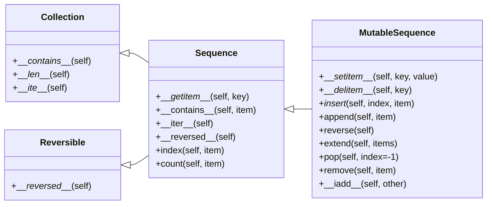

_Disclaimer: This article was written with the help of Gemini auto completion. It's scary how well it predicts
my next phrases, and how 'brain-dead' I become with it, so I might move away from it in the future._

Python inherits from ABC, its predecessor language, the common handling of sequences including strings, lists, arrays, byte sequences, and XML elements.

## Two types of Sequences

The sequences in the standard library can be split into two categories:

1. Container sequences -
   These can hold items of different types, including nested containers. E.g. `list`, `tuple`, and `collections.deque`.

2. Flat sequences -
   These hold items of one simple type. E.g. `str`, `bytes`, and `array.array`.

A container sequence holds refernces to the objects it contains, while a flat sequence stores the value of its contents in its own memory space.

Another way of categorizing sequences is by mutability:

1. Mutable sequences - `list`, `bytearray`, `array.array`, and `collections.deque`.

2. Immutable sequences - `tuple`, `str`, and `bytes`.

As the below diagram depicts, mutable sequences inherit all methods from immutable sequences, and implement additional methods.

The built-in concrete sequence types do not subclass the `Sequence` and `MutableSequence` ABCs, but they are _virtual subclasses_ registered with those ABCs.

Being virtual subclasses, `tuple` and `list` result in the following:

```python
>>> from collections import abc
>>> issubclass(tuple, abc.Sequence)
True
>>> issubclass(tuple, abc.MutableSequence)
False
>>> issubclass(list, abc.Sequence)
True
>>> issubclass(list, abc.MutableSequence)
True

```



_A simplified UML class diagram for the Collection, Reversible, Sequence, and MutableSequence ABCs. Inheritance arrows point from subclass to superclass. Names in italic are abstract methods._

## List Comprehensions and Generator Expressions

### List Comprehensions and Readability

List comprehensions and generator expressions provide a way to build sequences in a more readable way.

For example,

```python
>>> fruits = 'apple'
>>> ascii_codes = []
>>> for char in fruits:
...     ascii_codes.append(ord(char))
...
>>> ascii_codes
[97, 112, 112, 108, 101]
```

versus

```python
>>> fruits = 'apple'
>>> ascii_codes = [ord(char) for char in fruits]
>>> ascii_codes
[97, 112, 112, 108, 101]
```

List comprehensions are more explicit in the sense that their sole purpose is to build a new list, compared to a for loop.

The author further suggests to not use list comprehension for its side effects.

### Listcomps Versus map and filter

Listcomps achieve the same effect that `map` and `filter` functions, without the need to create `lambda` function.

For example:

```python
>>> fruits = 'apple'
>>> ascii_codes = [ord(char) for char in fruits if ord(char) > 100]
>>> ascii_codes
[112, 112, 108, 101]
>>> ascii_codes = list(filter(lambda x: x > 100, map(ord, fruits)))
>>> ascii_codes
[112, 112, 108, 101]
```

It seems listcomps execute faster than `map` and `filter`. More about this in Chapter 7.

### Generator Expressions

A genexp saves memory because it yields items one by one instead of constructing a whole list.

Genexps are enclosed in parentheses rather than square brackets.

```python
>>> fruits = 'apple'
>>> ascii_codes = tuple(ord(char) for char in fruits)
>>> ascii_codes
(97, 112, 112, 108, 101)
```

Here, the list of five elements is not built in memory. Instead, the generator expression feeds the `for` loop one item at a time.

## Tuples

Tuples can be used as immutable lists, and also as records with no field names, for example database records.

Try not to put mutable items in a tuple to avoid unpleasant surprises...

See more in the sections "What is Hashable" on page 84 and "The Relative Immutability of Tuples" on page 207.

## Unpacking Sequences

Unpacking not only avoids unnecessary use of indexes to access items from sequences, but also works with any iterable, including iterators, which do not support the `[]` index syntax.

Some features of tuple unpacking:

```python
# Basic unpacking
>>> point = (3, 4)
>>> x, y = point
>>> x
3
>>> y
4

# Unpacking with *
>>> first, *rest = [1, 2, 3, 4, 5]
>>> first
1
>>> rest
[2, 3, 4, 5]

# Practical use case: swapping values
>>> a, b = 10, 20
>>> a, b = b, a  # swap values
>>> a
20
>>> b
10
```

The `*` prefix in unpacking allows you to capture any number of items in a list.

## Pattern Matching with Sequences

Let's discuss the convenient `match/case` statement.

```python
def process_command(command):
    match command.split():
        case ["quit"]:
            print("Exiting...")
            return True

        case ["show", "todos"]:
            print("Displaying all todos")

        case ["add", *words]:
            todo = " ".join(words)
            print(f"Adding todo: {todo}")

        case ["delete", number]:
            print(f"Deleting todo #{number}")

        case _:
            print("Unknown command")
    return False

# Example usage:
>>> process_command("show todos")
Displaying all todos
>>> process_command("add buy groceries")
Adding todo: buy groceries
>>> process_command("delete 1")
Deleting todo #1
>>> process_command("unknown")
Unknown command
>>> process_command("quit")
Exiting...
```

The author left a footnote about the `fallthrough` and `dangling else` problems too, on page 40.

### Pattern Matching Sequences in an Interpreter

This section introduces an interpreter for a subset of the Sheme dialect of the Lisp language, written by Peter Norvig, in just 132 lines of Python code.

The author uses this as a base to discuss pattern matching.

## Slicing

A couple advantages of zero-based indexing are:

1. The length of a range can be found by just the stop position - range(3) and l[:3] both give three items.
2. The length of a slice is simply `stop - start`
3. We can easily split a sequence into two parts without overlapping - l[:x] and l[x:]

For example:

```python
>>> text = "Python"
>>> text[0:2]   # length is 2-0 = 2 characters
'Py'
>>> text[2:4]   # length is 4-2 = 2 characters
'th'
>>> text[4:6]   # length is 6-4 = 2 characters
'on'
```

Here's a practical example of splitting a sequence into three equal parts:

```python
>>> data = [1, 2, 3, 4, 5, 6]
>>> n = len(data) // 3  # length of each part
>>> [data[i:i+n] for i in range(0, len(data), n)]
[[1, 2], [3, 4], [5, 6]]
```

The zero-based system makes these calculations intuitive because the start index of each slice aligns with the length of preceding elements.

The author pays tribute to Prof. Dijstra for the 'best arguments' for this convention. See page 48.

## Using + and \* with Sequences

One of the pitfalls of using \* to initialize a list of lists is depicted by the below example.

```python
>>> board = [['_'] * 3] * 3

>>> board
[['_', '_', '_'], ['_', '_', '_'], ['_', '_', '_']]

>>> board[1][2] = 'X'
>>> board
[['_', '_', 'X'], ['_', '_', 'X'], ['_', '_', 'X']]
```

The proper way to inital such a board is

```python
>>> board = []
>>> for i in range(3):
...     row = ['_'] * 3
...     board.append(row)

or

>>> board = [['_'] * 3 for i in range(3)]
>>> board
[['_', '_', '_'], ['_', '_', '_'], ['_', '_', '_']]

>>> board[1][2] = 'X'
>>> board
[['_', '_', '_'], ['_', '_', 'X'], ['_', '_', '_']]

```

### A += Assignment Puzzler

An interesting one. See page 54.

Also the command `dis.dis({s[a] += b})` shows the disassembled version of bytecode, also known as opcode. \* Python code is compiled into bytecode = `assemble`

## Memory Views

The `memoryview` built-in class is a shared-memory sequence type that lets you handle slices of arrays without copying bytes. It's particularly useful when dealing with large data sets or when working with binary data.

```python
>>> numbers = bytearray(b'123456')
>>> view = memoryview(numbers)
>>> view[1] = 52  # ASCII code for '4'
>>> numbers
bytearray(b'143456')

# Slicing without copying
>>> view_slice = view[2:4]
>>> view_slice
<memory at ...>
>>> bytes(view_slice)
b'34'

# Converting types while reusing memory
>>> numbers = array.array('h', [-2, -1, 0, 1, 2])  # signed short integers
>>> view = memoryview(numbers)
>>> view[1] = 5
>>> numbers
array('h', [-2, 5, 0, 1, 2])
```
